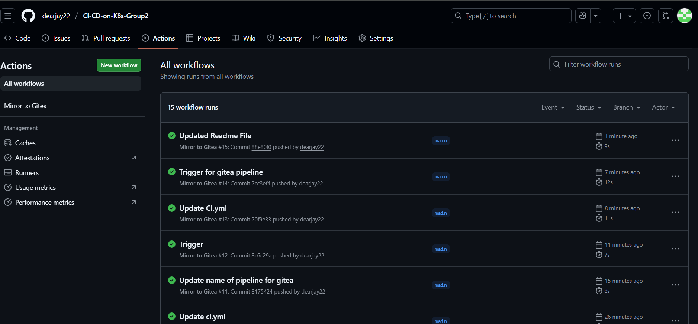
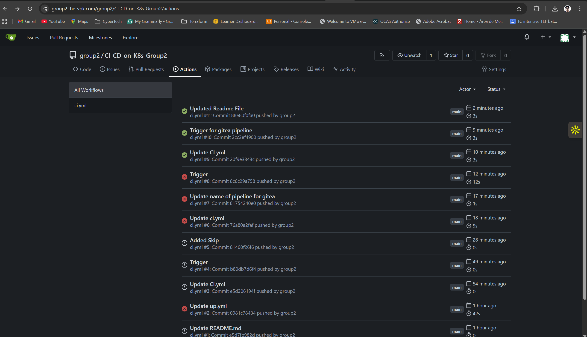
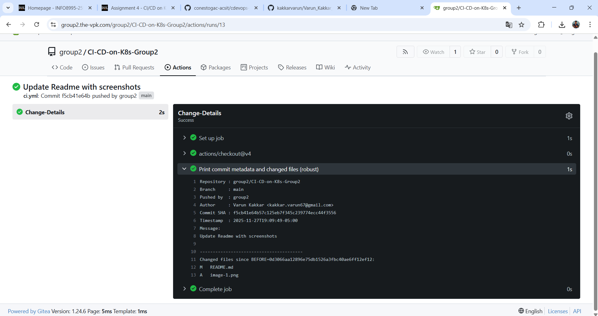

# CI/CD on Kubernetes — Group 2 (Gitea + Cloudflare + MySQL)


  
**Repo:** `CI-CD-on-K8s-Group2`  
**Primary URL:** https://group2.the-vpk.com  
---

## 🔭 Objective

Start an **open-source CI/CD pipeline** on a Kubernetes cluster using **Gitea Actions**, expose it publicly using **Cloudflare Tunnel**, and use an **external MySQL** with persistence.  
Also configure **GitHub → Gitea mirroring** (one-way) and a **Gitea CI** that prints commit metadata & changed files for each push.

---

## 🗺️ Architecture

```
Users (Browser)
   │
   ├── DNS/HTTPS (Cloudflare)
   │      └─ Tunnel → cloudflared (Deployment in gitea ns)
   │                     └─ routes:
   │                        group2.the-vpk.com → http://gitea-http.gitea.svc.cluster.local:3000
   │
Kubernetes (k3s)
└─ Namespace: gitea
   ├─ Gitea (Helm chart)  ← data/config PVCs
   │     └─ External DB: MySQL 8.0 (StatefulSet + PVC 10Gi)
   ├─ cloudflared (Deployment)  ← Tunnel token Secret
   └─ (Optional) gitea/act_runner as VM or K8s Deployment (labels include ubuntu-latest)
```

---

## ✅ What Works

- Gitea reachable at **https://group2.the-vpk.com** via **Cloudflare Tunnel**.
- Gitea Uses **external MySQL 8.0** with persistent volume (no bundled Postgres/Valkey).
- **Runner** online with **`ubuntu-latest`** label mapping to a Node-ready image, so **`actions/checkout@v4`** works.
- **GitHub → Gitea mirroring** with safe **force-with-lease**, **no loops**.
- Gitea CI Workflow **prints who pushed, commit SHA, message, and changed files** (robust even when `before` commit is missing).

---

## 🧩 Repositories & Workflows

### 1) GitHub → Gitea Mirror (in GitHub repo)
`/.github/workflows/mirror-to-gitea.yml`  
Uses secrets:
- `GITEA_USERNAME=group2`
- `GITEA_TOKEN=<Gitea PAT with repo scope>`

Mirrors current branch to Gitea. Skips if remote already has the same commit (SHA check). Uses `--force-with-lease` if histories diverge.

### 2) Gitea CI: Commit Info (in Gitea repo)
`/.gitea/workflows/ci.yml`  
On each push, prints:
- Repository, branch, **pusher**, **author**, **SHA**, timestamp, message  
- **Changed files** between `before` and `after` (or fallback to parent/root)

> We **do not** mirror Gitea → GitHub anymore (to avoid loops). Only GitHub → Gitea is enabled.

---

## 🛠️ Install & Ops (from zero)

> Run these on the Ubuntu VM that already talks to the cluster.

### 0) Tooling
```bash
sudo apt-get update && sudo apt-get install -y git curl python3-pip unzip
python3 -m pip install --user ansible kubernetes
ansible-galaxy collection install kubernetes.core --force
export PATH="$HOME/.local/bin:$PATH"
```

### 1) Namespace & Secrets (MySQL)
```bash
kubectl create ns gitea || true
MYSQL_ROOT_PASSWORD=$(openssl rand -base64 24)
MYSQL_GITEA_PASSWORD=$(openssl rand -base64 24)
kubectl -n gitea create secret generic mysql-secrets \
  --from-literal=mysql-root-password="$MYSQL_ROOT_PASSWORD" \
  --from-literal=mysql-gitea-password="$MYSQL_GITEA_PASSWORD"
```

### 2) MySQL 8.0 (official image) with PVC
Create `k8s-mysql-official.yaml` (Service + StatefulSet, 10Gi PVC, `local-path` storage class), then:
```bash
kubectl apply -f k8s-mysql-official.yaml
kubectl -n gitea rollout status statefulset/mysql --timeout=5m
```

### 3) Gitea via Helm (external MySQL, persistence)
`values-prod.yaml` **(key items)**:
```yaml
postgresql: { enabled: false }
postgresql-ha: { enabled: false }
memcached: { enabled: false }
redis: { enabled: false }
redis-cluster: { enabled: false }
valkey: { enabled: false }
valkey-cluster: { enabled: false }

persistence:
  enabled: true
  data:   { enabled: true, size: 10Gi, storageClass: local-path }
  config: { enabled: true, size: 1Gi,  storageClass: local-path }

service: { http: { type: ClusterIP } }

gitea:
  config:
    database:
      DB_TYPE: mysql
      HOST: mysql.gitea.svc.cluster.local:3306
      NAME: gitea
      USER: gitea
      PASSWD: "__MYSQL_GITEA_PASSWORD__"
    server:
      ROOT_URL: "https://group2.the-vpk.com/"
      DOMAIN:   "group2.the-vpk.com"
      PROTOCOL: http
      HTTP_PORT: 3000
      DISABLE_SSH: true
```

Install/update:
```bash
helm repo add gitea https://dl.gitea.com/charts/ || true
helm repo update
MYSQL_GITEA_PASSWORD=$(kubectl -n gitea get secret mysql-secrets -o jsonpath='{.data.mysql-gitea-password}' | base64 -d)

helm -n gitea upgrade --install gitea gitea/gitea -f values-prod.yaml \
  --set gitea.config.database.PASSWD="$MYSQL_GITEA_PASSWORD" \
  --set postgresql.enabled=false --set postgresql-ha.enabled=false \
  --set memcached.enabled=false --set redis.enabled=false \
  --set redis-cluster.enabled=false --set valkey.enabled=false --set valkey-cluster.enabled=false \
  --set deployment.strategy.type=Recreate
```

### 4) Cloudflare Tunnel
- Create tunnel in Cloudflare Zero Trust; copy **tunnel token**.
- Public Hostname: `group2.the-vpk.com` → **HTTP** → `http://gitea-http.gitea.svc.cluster.local:3000`
- In cluster:
```bash
kubectl -n gitea create secret generic cloudflared-secret \
  --from-literal=tunnel-token='<PASTE_TUNNEL_TOKEN>'

cat <<'YAML' | kubectl apply -f -
apiVersion: apps/v1
kind: Deployment
metadata: { name: cloudflared, namespace: gitea }
spec:
  replicas: 1
  selector: { matchLabels: { app: cloudflared } }
  template:
    metadata: { labels: { app: cloudflared } }
    spec:
      containers:
        - name: cloudflared
          image: cloudflare/cloudflared:latest
          args: ["tunnel","--no-autoupdate","run","--token","$(TUNNEL_TOKEN)"]
          env:
            - name: TUNNEL_TOKEN
              valueFrom: { secretKeyRef: { name: cloudflared-secret, key: tunnel-token } }
YAML
```
Open **https://group2.the-vpk.com** and finish Gitea initial setup.

### 5) Runner (label with Node-ready image)
**VM runner (example):**
```bash
docker rm -f gitea-runner 2>/dev/null || true
docker run -d --name gitea-runner \
  -e GITEA_INSTANCE_URL=https://group2.the-vpk.com \
  -e GITEA_RUNNER_REGISTRATION_TOKEN=<PASTE_REG_TOKEN> \
  -e GITEA_RUNNER_NAME=vm-runner \
  -e GITEA_RUNNER_LABELS="ubuntu-latest:docker://ghcr.io/catthehacker/ubuntu:act-22.04,self-hosted" \
  -v /var/run/docker.sock:/var/run/docker.sock \
  gitea/act_runner:latest
```
Confirm **Site Admin → Actions → Runners** shows **Online** with labels.

---

## ⚙️ Workflows (final)

### A) GitHub → Gitea Mirror
`.github/workflows/mirror-to-gitea.yml` (in GitHub)
- Mirrors current branch to Gitea using `GITEA_USERNAME=group2` & PAT
- Skips if remote already has the same **SHA**
- Uses `--force-with-lease` only when necessary

### B) Gitea CI — Commit Info (robust)
`.gitea/workflows/ci.yml` (in Gitea)
- Runs on each push to the Gitea repo
- Prints pusher, author, SHA, message, and changed files
- Handles cases where `github.event.before` is missing/not fetched

---

## 🧪 How to Trigger

- **Normal dev flow:** push to **GitHub** → GH Action mirrors to **Gitea** → Gitea CI runs, prints commit info (no loops).
- **Direct Gitea push (rare):** Gitea CI runs and prints info. (No mirroring back.)

---

## 🧷 Secrets (kept out of Git)

- **Gitea PAT** (for GitHub→Gitea mirror): stored in GitHub repo secrets as `GITEA_TOKEN`
- **Cloudflare Tunnel Token**: stored as K8s Secret `cloudflared-secret`
- **MySQL credentials**: stored as K8s Secret `mysql-secrets`

---

## 🧰 Troubleshooting (what we faced & fixes)

| Symptom / Error | Root Cause | Fix |
|---|---|---|
| `git pull` refused (divergent histories) | Template + repo histories | `git pull … --allow-unrelated-histories --no-rebase` |
| Bitnami MySQL `Init:ImagePullBackOff` | Image access limitation | Switched to **official mysql:8.0** StatefulSet with PVC |
| Gitea `Init:CrashLoopBackOff` / no endpoints | Bundled Postgres/Valkey installed by default | Disabled **postgresql/valkey**; used external **MySQL** |
| Cloudflared log `no such host gitea-http…` | Service or endpoints not ready | Wait for Gitea pod Ready; verify `kubectl -n gitea get endpoints gitea-http` |
| Actions stuck on “Waiting” | No eligible runner/labels | Ensure runner **Online**; labels include `ubuntu-latest` or use `runs-on: self-hosted` |
| `Cannot find: node in PATH` | `actions/checkout@v4` needs Node | Runner label maps to `ghcr.io/catthehacker/ubuntu:act-22.04` (has Node) |
| `fatal: bad object <BEFORE_SHA>` | `before` not in history (new branch/force/mirror) | CI uses fallback to parent/root; prints changed files reliably |

---

## 📸 Screenshots (evidence)







---